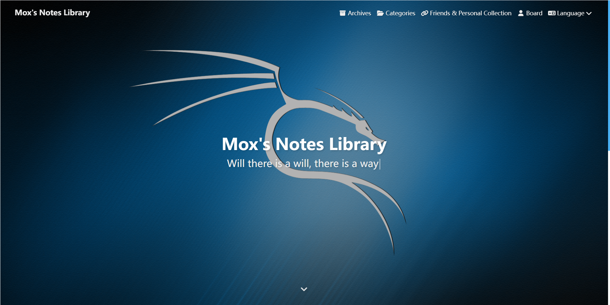

🚧🚧**Warning: The project is still in the development phase and project availability is not guaranteed** 🚧🚧

# Astrofly

[](https://astro.build)

Inspire by the [hexo-theme-butterfly](https://github.com/jerryc127/hexo-theme-butterfly) and [HsuBlog](https://github.com/KraHsu/HsuBlog)




## 💻 Installation

- Git

 ```
  git clone https://github.com/mocusez/astro-astrofly.git blog
  cd blog
  pnpm install
 ```


## 🧞 Commands

All commands are run from the root of the project, from a terminal:

| Command                   | Action                                           |
| :------------------------ | :----------------------------------------------- |
| `npm install`             | Installs dependencies                            |
| `npm run dev`             | Starts local dev server at `localhost:4321`      |
| `npm run build`           | Build your production site to `./dist/`          |
| `npm run preview`         | Preview your build locally, before deploying     |
| `npm run astro ...`       | Run CLI commands like `astro add`, `astro check` |
| `npm run astro -- --help` | Get help using the Astro CLI                     |
| `npm run newpage`         | Generate new post base on template               |
| `npm run sync`            | Publish the site by system script                |

