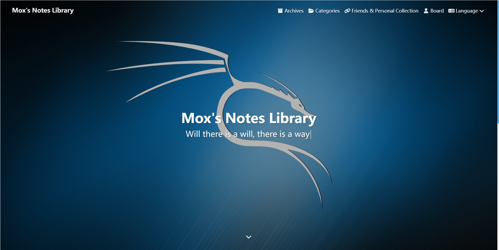

# Astrofly

[](https://astro.build)

English | [简体中文](./README_zh-CN.md)

Inspire by the [hexo-theme-butterfly](https://github.com/jerryc127/hexo-theme-butterfly) and [HsuBlog](https://github.com/KraHsu/HsuBlog)



## Features

- **Astro v6** — Built on the latest Astro for fast, static-first performance
- **Bilingual Support** — Chinese (zh-CN) and English content with language-specific routing
- **Full-Text Search** — Lightning-fast static search powered by [Pagefind](https://pagefind.app/), with multilingual support and mobile optimization
- **PWA Support** — Installable as a Progressive Web App with offline access, auto cache versioning on build
- **Waline Comments** — Integrated [Waline](https://waline.js.org/) comment system with pageview counting and dark mode support
- **Expressive Code** — Syntax highlighting powered by Shiki, with custom MLIR/LLVM grammar support
- **Tailwind CSS** — Utility-first styling with dark/light theme toggle
- **Sitemap** — Auto-generated sitemap for SEO
- **Responsive Design** — Mobile-friendly layout with adaptive navigation

## 💻 Installation

- Git

 ```
  git clone https://github.com/mocusez/astro-astrofly.git blog
  cd blog
  pnpm install
  pnpm approve-builds
  mv example_content content  # Use example content as your content directory
 ```

### Use as template

```
pnpm create astro@latest -- --template mocusez/astro-astrofly
mv example_content content  # Use example content as your content directory
```


## 🧞 Commands

All commands are run from the root of the project, from a terminal:

| Command                   | Action                                           |
| :------------------------ | :----------------------------------------------- |
| `npm install`             | Installs dependencies                            |
| `npm run dev`             | Starts local dev server at `localhost:4321`      |
| `npm run build`           | Build your production site to `./dist/`          |
| `npm run preview`         | Preview your build locally, before deploying     |
| `npm run astro ...`       | Run CLI commands like `astro add`, `astro check` |
| `npm run astro -- --help` | Get help using the Astro CLI                     |
| `npm run newpage`         | Generate new post base on template               |
| `npm run sync`            | Publish the site by system script                |

## 🌍 Translation

We welcome translation contributions via Weblate!

[](https://hosted.weblate.org/projects/astro-astrofly/astro-astrofly/)

Visit [Weblate](https://hosted.weblate.org/projects/astro-astrofly/astro-astrofly/) to help translate Astrofly into your language.

